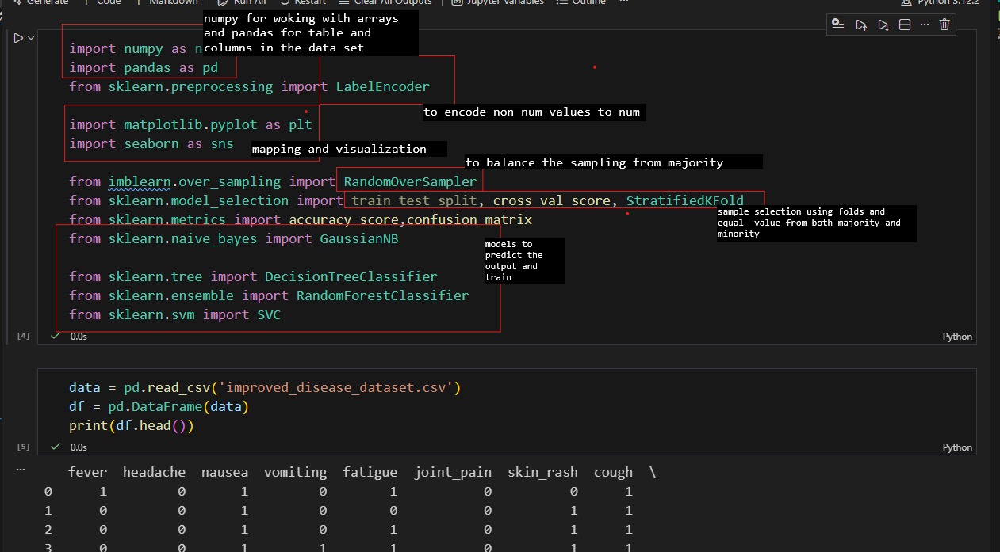
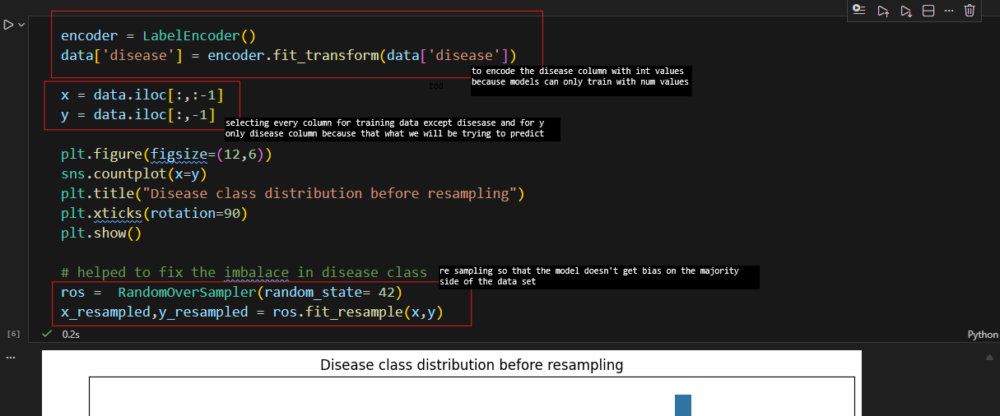
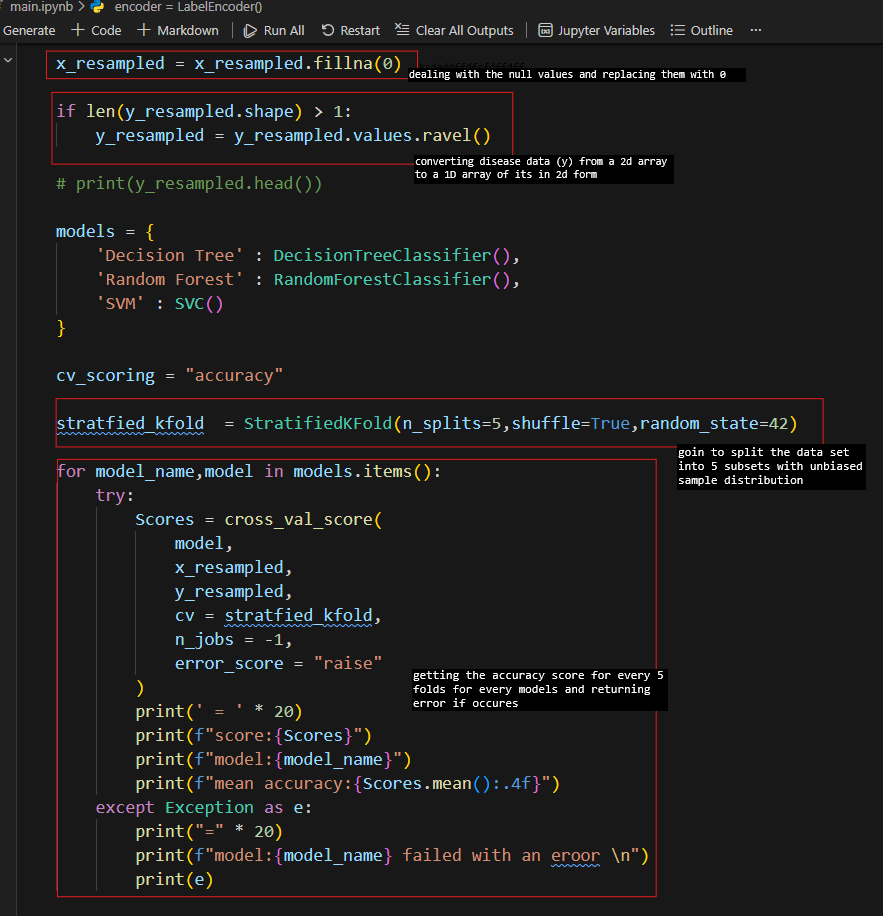
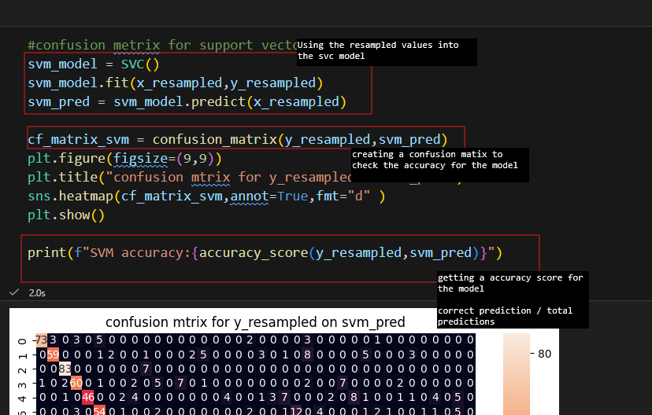
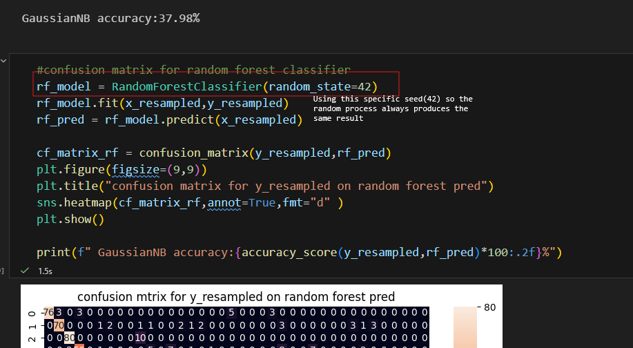
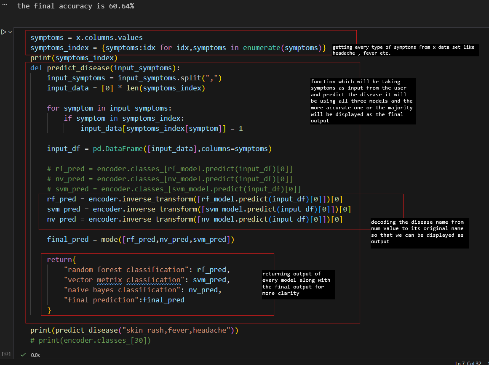

# Disease Prediction System
## Overview

This project is a machine learning-based disease prediction system that predicts possible diseases based on symptoms provided by the user.
The model is trained using multiple classification algorithms and combines their predictions to generate a final result.
The goal of the project is to demonstrate practical machine learning workflow, including data preprocessing, resampling, model training, evaluation, and prediction.

## Features

* Predict diseases based on input symptoms
* Uses multiple ML algorithms for better accuracy
* Handles imbalanced dataset using Random Oversampling
* Model evaluation using Stratified K-Fold Cross Validation
* Final prediction generated using majority voting

## Technologies Used

* Python
* Pandas
* NumPy
* Scikit-learn
* Matplotlib
* Seaborn
* Imbalanced-learn

## Machine Learning Models Used

* The system trains and compares multiple classification models:
* Random Forest Classifier
* Support Vector Machine (SVM)
* Naive Bayes
* The final prediction is generated using ensemble voting between these models.

## Here are some ss of the code

